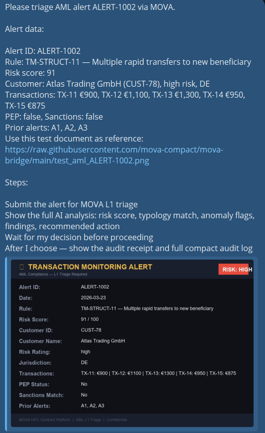
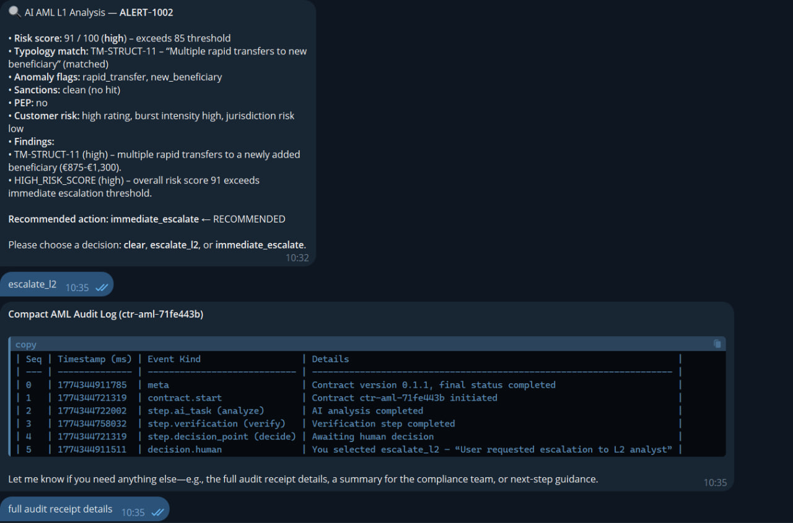
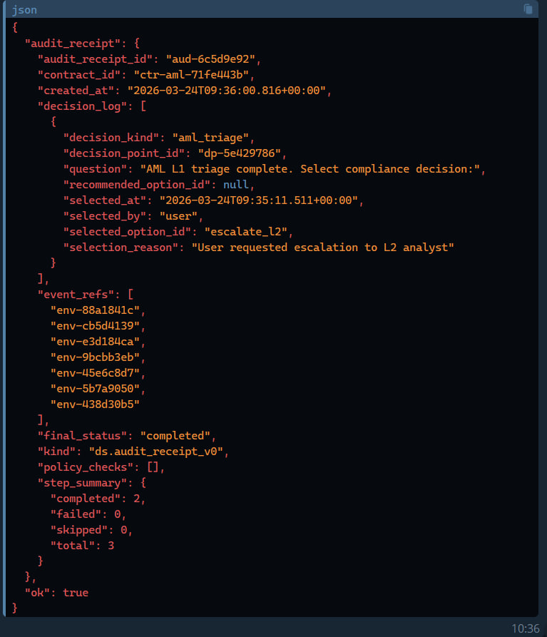

# MOVA AML Alert Triage

Submit a transaction monitoring alert to MOVA for automated L1 triage — with typology matching, sanctions screening, and a human compliance decision gate backed by a tamper-proof audit trail.

## What it does

1. **AI triage** — checks sanctions lists (OFAC/EU/UN), PEP status, transaction burst patterns, customer risk rating, prior alert history, and typology matching (structuring, layering, smurfing, etc.)
2. **Risk snapshot** — surfaces anomaly flags and triage recommendation
3. **Human decision gate** — compliance analyst chooses: clear / escalate to L2 / immediate escalate
4. **Audit receipt** — every decision is signed, timestamped, and stored in an immutable compact journal

**Mandatory escalation rules enforced by policy:**
- Risk score > 85 → mandatory human escalation
- Sanctions hit → immediate escalation, no exceptions
- PEP flag → mandatory L2 escalation

## Requirements

**Binary:** `mova-bridge` CLI — install once:
```
pip install mova-bridge
```
Source: [PyPI](https://pypi.org/project/mova-bridge/) · [GitHub](https://github.com/mova-compact/mova-bridge) · License: MIT-0

**Credential:** Set `MOVA_API_KEY` in your OpenClaw environment (Settings → Environment Variables).
Get your key at [mova-lab.eu/register](https://mova-lab.eu/register).

**Data flows:**
- Alert data + customer ID + transactions → `api.mova-lab.eu` (MOVA platform, EU-hosted)
- Customer data → sanctions screening (OFAC, EU, UN — read-only, no data stored)
- Customer ID → risk rating and prior alert history (read-only)
- Audit journal → MOVA R2 storage, cryptographically signed, accessible only via your API key
- No data is sent to third parties beyond the above

## Quick start

Say "triage AML alert ALERT-1002" and provide the alert details:

```
https://raw.githubusercontent.com/mova-compact/mova-bridge/main/test_aml_ALERT-1002.png
```

The agent submits the alert to MOVA, runs L1 triage with typology matching and sanctions screening, then asks the compliance analyst for a decision.

## Demo

**Step 1 — Alert submitted: TM-STRUCT-11, risk 91, RISK HIGH flag**


**Step 2 — AI analysis: structuring typology matched, risk 91/100, escalate_l2 decision**


**Step 3 — Audit receipt + compact journal with full compliance event chain**


## Why contract execution matters

A standard AI agent checks the alert and gives you a recommendation. MOVA does something different:

- **Escalation rules are policy, not prompts** — risk_score > 85 and sanctions hits trigger mandatory gates that cannot be bypassed, regardless of what the AI recommends
- **Full typology matching** — AI identifies structuring, layering, and smurfing patterns against your transaction monitoring rules, not generic text
- **Immutable audit trail** — the compact journal records every event (sanctions check, typology match, human decision) with cryptographic proof. When a regulator asks "who cleared or escalated ALERT-1002 and why?" — the answer is in the system with an exact timestamp and reason
- **AMLD6 / FATF ready** — AML decisions are high-risk compliance actions. MOVA provides the human oversight, full explainability, and documented decision chain required by AMLD6 and FATF guidance

## What the user receives

| Output | Description |
|--------|-------------|
| Risk score | 0–100 assessment with threshold evaluation |
| Typology match | Rule ID + description (structuring, layering, etc.) |
| Sanctions check | OFAC / EU / UN screening result |
| PEP status | PEP flag with category |
| Customer risk | Risk rating, burst intensity, jurisdiction risk |
| Anomaly flags | rapid_transfer, new_beneficiary, high_burst, sanctions_hit, pep_flag |
| Findings | Structured list with severity codes |
| Prior alerts | Historical alert count |
| Recommended action | AI-suggested triage decision |
| Decision options | clear / escalate_l2 / immediate_escalate |
| Audit receipt ID | Permanent signed record of the compliance decision |
| Compact journal | Full event log: triage → sanctions → human decision |

## When to trigger

Activate when the user:
- Mentions an alert ID (e.g. "ALERT-1002")
- Says "triage this alert", "review AML alert", "check transaction monitoring alert"
- Provides customer and transaction data for compliance review

**Before starting**, confirm: "Submit alert [alert_id] for MOVA L1 triage?"

If details are missing — ask once for: alert ID, rule ID, risk score, customer ID, customer jurisdiction, triggered transactions.

## Step 1 — Submit alert

    mova-bridge call mova_hitl_start_aml --alert-id ALERT-1002 --rule-id TM-STRUCT-11 --rule-description "Multiple rapid transfers to new beneficiary" --risk-score 91 --customer-id CUST-78 --customer-name "Atlas Trading GmbH" --customer-risk-rating high --customer-type business --customer-jurisdiction DE --triggered-transactions '[{"transaction_id":"TX-11","amount_eur":900}]' --pep-status false --sanctions-match false --historical-alerts '["A1","A2","A3"]'

## Step 2 — Show analysis and decision options

If `status = "waiting_human"` — show AI triage summary and ask to choose:

- **clear** — Clear as false positive
- **escalate_l2** — Escalate to L2 analyst
- **immediate_escalate** — Immediate escalation — freeze account

Show `recommended` option if present (mark ← RECOMMENDED).

Then run:

    mova-bridge call mova_hitl_decide --contract-id CONTRACT_ID --option OPTION --reason "REASON"

Use CONTRACT_ID from the JSON response — not the alert ID.

## Step 3 — Show audit receipt

    mova-bridge call mova_hitl_audit --contract-id CONTRACT_ID
    mova-bridge call mova_hitl_audit_compact --contract-id CONTRACT_ID

## Rules

- NEVER make HTTP requests manually
- NEVER invent or simulate results — if exec fails, show the exact error
- Run exec directly: `mova-bridge call ...` (not wrapped in bash or sh)
- CONTRACT_ID comes from the mova-bridge JSON response, not from the alert ID
