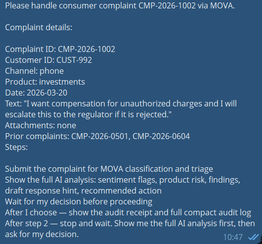
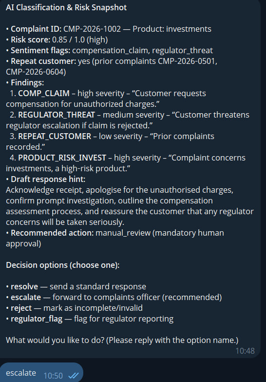
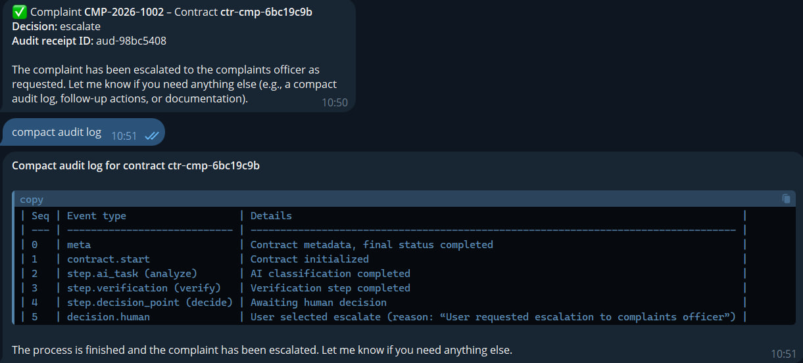

# MOVA EU Consumer Complaints Handler

Turn any customer complaint into a structured, auditable handling decision — with AI triage, EU-compliant mandatory human review, and a signed audit receipt.

## Why use this skill

- **AI classifies in seconds** — sentiment flags, product risk, regulator threat detection, repeat customer check
- **Mandatory human gate** — compensation claims, regulator threats, high-risk products, and fraud signals always route to a human officer
- **Full audit trail** — every decision is timestamped, signed, and stored in an immutable MOVA audit journal (EBA/ESMA-ready)
- **Draft response hint** — AI suggests tone and content for the customer response

## Requirements

| Requirement | Details |
|---|---|
| Binary | `mova-bridge` CLI — install: `pip install mova-bridge` |
| Credential | `MOVA_API_KEY` — set in OpenClaw agent environment |
| Account | Free at [mova-compact/mova-bridge](https://github.com/mova-compact/mova-bridge) |

## Quick start

```
pip install mova-bridge
export MOVA_API_KEY=your_key_here
```

Then tell your agent:
> "Handle complaint CMP-2026-1002 from customer CUST-992 — product: investments, text: 'I want compensation for unauthorized charges and will escalate to the regulator.', prior complaints: CMP-0501, CMP-0604"

## What the agent does

**Step 1 — Submit complaint**

```
mova-bridge call mova_hitl_start_complaint \
  --complaint-id CMP-2026-1002 \
  --customer-id CUST-992 \
  --complaint-text "..." \
  --channel phone \
  --product-category investments \
  --complaint-date 2026-03-20 \
  --previous-complaints '["CMP-2026-0501","CMP-2026-0604"]'
```

**Step 2 — AI analysis output**

```
Complaint:       CMP-2026-1002 — investments
Risk score:      0.85 / 1.0  (high)
Sentiment flags: compensation_claim, regulator_threat
Repeat customer: yes (2 prior complaints)
Findings:
  • COMP_CLAIM (high)           — Customer requests compensation for unauthorized charges
  • REGULATOR_THREAT (medium)   — Customer threatens regulator escalation
  • PRODUCT_RISK_INVEST (high)  — High-risk product category
Draft response hint: Acknowledge receipt, confirm investigation, outline compensation
  process, reassure on regulator concerns
Recommended action: escalate ← RECOMMENDED
```

**Step 3 — Human decision gate**

| Option | Description |
|---|---|
| `resolve` | Send standard response |
| `escalate` | Forward to complaints officer ← recommended |
| `reject` | Mark as incomplete / invalid |
| `regulator_flag` | Flag for regulator reporting |

**Step 4 — Audit receipt**

```
✅ Complaint CMP-2026-1002 — ctr-cmp-xxxxxxxx

Decision:      escalate
Audit receipt: aud-xxxxxxxx
```

Full immutable log available via:
```
mova-bridge call mova_hitl_audit_compact --contract-id ctr-cmp-xxxxxxxx
```

## Audit log format (compact)

| Seq | Event | Details |
|---|---|---|
| 1 | contract.start | Complaint submitted |
| 2 | step.ai_task | Classification completed |
| 3 | step.verification | Risk snapshot passed |
| 4 | step.decision_point | Awaiting human |
| 5 | decision.human | Officer selected option + reason |
| 0 | meta | Contract finalized, status: completed |

## Demo





## Test complaint

[test_complaint_CMP-2026-1002.png](https://raw.githubusercontent.com/mova-compact/mova-bridge/main/test_complaint_CMP-2026-1002.png)

## Data flows

- Complaint text and metadata → MOVA Classification API (EU-hosted)
- Human decision → MOVA Audit Journal (immutable, signed)
- No data stored locally or sent to third parties

## Connect your real CRM and policy systems

By default MOVA uses a sandbox mock for all connector calls. To route checks against your live CRM and policy engine, register your endpoints — see the **MOVA Connector Setup** skill or run:

    mova-bridge call mova_list_connectors --keyword crm

Relevant connectors for this skill:

| Connector ID | What it covers |
|---|---|
| `connector.crm.customer_lookup_v1` | Customer history and prior complaints from CRM |
| `connector.policy.complaints_rules_v1` | Complaints handling rules by product/jurisdiction |
| `connector.notification.email_v1` | Customer notification email |

Register an endpoint:

    mova-bridge call mova_register_connector \
      --connector-id connector.crm.customer_lookup_v1 \
      --endpoint https://your-crm.example.com/api/customers \
      --label "Production CRM" \
      --auth-header Authorization --auth-value "Bearer YOUR_TOKEN"

All contracts in your org will use your endpoint instead of the mock immediately.

## Rules

- Agent never makes HTTP requests directly
- Agent never invents or simulates results
- Exec runs `mova-bridge call ...` directly — never wrapped in bash
