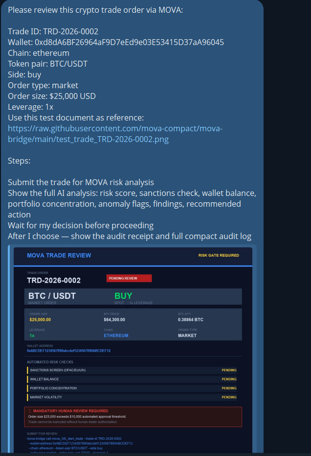
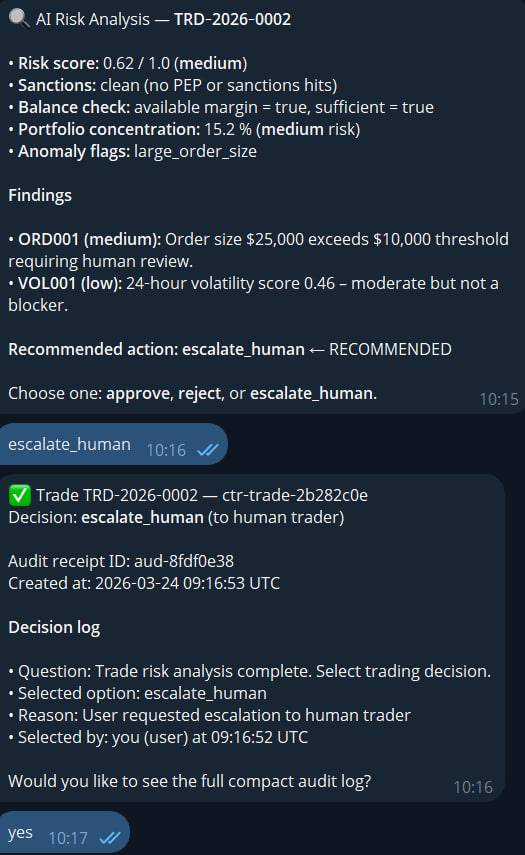
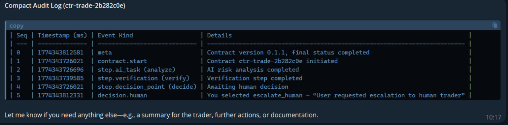

# MOVA Crypto Trade Review

Submit a crypto trade order to MOVA for automated risk analysis and a mandatory human decision gate — with a tamper-proof audit trail of every trading decision.

## What it does

1. **Risk analysis** — AI checks wallet sanctions screening (OFAC/EU/UN), wallet balance, portfolio concentration, and market volatility
2. **Risk snapshot** — scores the trade (0.0–1.0) and surfaces anomaly flags
3. **Human decision gate** — trader chooses: approve / reject / escalate to human trader
4. **Audit receipt** — every decision is signed, timestamped, and stored in an immutable compact journal

**Mandatory rules enforced by policy:**
- Orders ≥ $10,000 → mandatory human escalation, no exceptions
- Leverage > 3x → mandatory escalation
- Sanctions hit → immediate rejection

## Requirements

**Binary:** `mova-bridge` CLI — install once:
```
pip install mova-bridge
```
Source: [PyPI](https://pypi.org/project/mova-bridge/) · [GitHub](https://github.com/mova-compact/mova-bridge) · License: MIT-0

**Credential:** Set `MOVA_API_KEY` in your OpenClaw environment (Settings → Environment Variables).
Get your key at [mova-lab.eu/register](https://mova-lab.eu/register).

**Data flows:**
- Trade details + wallet address → `api.mova-lab.eu` (MOVA platform, EU-hosted)
- Wallet address → sanctions screening (OFAC, EU, UN — read-only, no data stored)
- Token pair → market data connector (price and volatility — read-only)
- Audit journal → MOVA R2 storage, cryptographically signed, accessible only via your API key
- No data is sent to third parties beyond the above

## Quick start

Say "review trade TRD-2026-0002: buy $25,000 BTC/USDT on ethereum":

```
https://raw.githubusercontent.com/mova-compact/mova-bridge/main/test_trade_TRD-2026-0002.png
```

The agent submits it to MOVA, shows the AI risk analysis with sanctions check, balance, and anomaly flags, then asks for your decision.

## Demo

**Step 1 — Task submitted with trade document (RISK GATE REQUIRED)**


**Step 2 — AI analysis: risk 0.62, sanctions clean, large_order_size flag, escalate_human recommended**


**Step 3 — Compact audit log with full event timeline**


## Why contract execution matters

A standard AI agent checks the trade and gives you an opinion. MOVA does something different:

- **Policy is law, not a suggestion** — orders above $10,000 cannot be auto-approved regardless of risk score. The policy gate is enforced at the runtime level, not in a prompt
- **Sanctions screening is mandatory** — every wallet is checked against OFAC, EU, and UN lists before any decision is presented to the user
- **Immutable audit trail** — the compact journal records every event (sanctions check, risk analysis, human decision) with cryptographic proof. When a compliance officer asks "who escalated trade TRD-2026-0002 and why?" — the answer is in the system with an exact timestamp and reason
- **MiCA / EU AI Act ready** — high-value crypto transactions require human oversight and full explainability. MOVA provides both by design

## What the user receives

| Output | Description |
|--------|-------------|
| Risk score | 0.0 (clean) – 1.0 (critical) |
| Sanctions check | OFAC / EU / UN / PEP screening result |
| Balance check | Wallet balance, available margin |
| Portfolio concentration | Concentration %, risk level |
| Market volatility | 24h volatility score |
| Anomaly flags | large_order_size, high_leverage, sanctions_hit, etc. |
| Findings | Structured list with severity codes |
| Recommended action | AI-suggested decision |
| Decision options | approve / reject / escalate_human |
| Audit receipt ID | Permanent signed record of the trading decision |
| Compact journal | Full event log: analysis → sanctions → human decision |

## When to trigger

Activate when the user:
- Mentions a trade order ID (e.g. "TRD-2026-001")
- Provides a wallet address and token pair with trade details
- Says "review this trade", "check this order", "approve trade"

**Before starting**, confirm: "Submit trade [trade_id] for MOVA risk review?"

If details are missing — ask once for: trade ID, wallet address, chain, token pair, side (buy/sell), order size in USD, leverage.

## Step 1 — Submit trade order

    mova-bridge call mova_hitl_start_trade --trade-id TRD-2026-0001 --wallet-address 0xABC123... --chain ethereum --token-pair BTC/USDT --side buy --order-type market --order-size-usd 25000 --leverage 1

## Step 2 — Show analysis and decision options

If `status = "waiting_human"` — show risk summary and ask to choose:

- **approve** — Approve trade
- **reject** — Reject trade
- **escalate_human** — Escalate to human trader

Show `recommended` option if present (mark ← RECOMMENDED).

Then run:

    mova-bridge call mova_hitl_decide --contract-id CONTRACT_ID --option OPTION --reason "REASON"

Use CONTRACT_ID from the JSON response — not the trade ID.

## Step 3 — Show audit receipt

    mova-bridge call mova_hitl_audit --contract-id CONTRACT_ID
    mova-bridge call mova_hitl_audit_compact --contract-id CONTRACT_ID

## Connect your real market data and custody systems

By default MOVA uses a sandbox mock for all connector calls. To route checks against your live trading infrastructure, register your endpoints — see the **MOVA Connector Setup** skill or run:

    mova-bridge call mova_list_connectors --keyword market

Relevant connectors for this skill:

| Connector ID | What it covers |
|---|---|
| `connector.market.price_feed_v1` | Live spot price, volume, and volatility |
| `connector.wallet.balance_v1` | Wallet balance and open positions |
| `connector.market.portfolio_risk_v1` | Portfolio VaR, concentration, leverage |
| `connector.screening.pep_sanctions_v1` | Wallet sanctions screening (OFAC, EU, UN) |

Register an endpoint:

    mova-bridge call mova_register_connector \
      --connector-id connector.market.price_feed_v1 \
      --endpoint https://your-exchange.example.com/api/price \
      --label "Production Price Feed" \
      --auth-header X-Api-Key --auth-value YOUR_KEY

All contracts in your org will use your endpoint instead of the mock immediately.

## Rules

- NEVER make HTTP requests manually
- NEVER invent or simulate results — if exec fails, show the exact error
- Run exec directly: `mova-bridge call ...` (not wrapped in bash or sh)
- CONTRACT_ID comes from the mova-bridge JSON response, not from the trade ID
