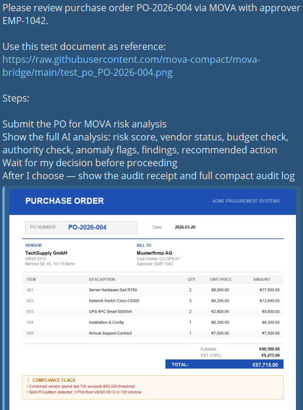
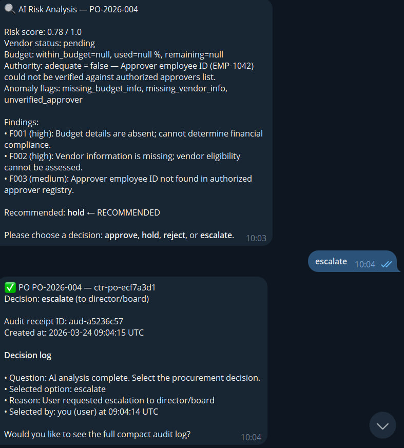
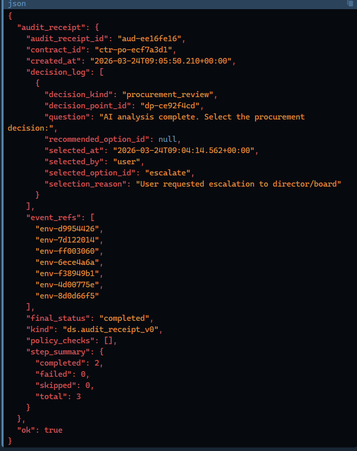

# MOVA Purchase Order Approval

Submit a purchase order to MOVA for automated risk analysis and a human decision gate — with a tamper-proof audit trail of every procurement decision.

## What it does

1. **Risk analysis** — AI checks vendor registry, budget utilisation, authority level, and detects split-PO fraud patterns
2. **Risk snapshot** — scores the PO (0.0–1.0) and surfaces anomaly flags
3. **Human decision gate** — procurement manager chooses: approve / hold / reject / escalate
4. **Audit receipt** — every decision is signed, timestamped, and stored in an immutable compact journal

## Requirements

**Binary:** `mova-bridge` CLI — install once:
```
pip install mova-bridge
```
Source: [PyPI](https://pypi.org/project/mova-bridge/) · [GitHub](https://github.com/mova-compact/mova-bridge) · License: MIT-0

**Credential:** Set `MOVA_API_KEY` in your OpenClaw environment (Settings → Environment Variables).
Get your key at [mova-lab.eu/register](https://mova-lab.eu/register).

**Data flows:**
- PO ID + approver ID → `api.mova-lab.eu` (MOVA platform, EU-hosted)
- ERP connector reads vendor registry, budget data, authority matrix (read-only, no data stored)
- Audit journal → MOVA R2 storage, cryptographically signed, accessible only via your API key
- No data is sent to third parties beyond the above

## Quick start

Say "review PO-2026-004 with approver EMP-1042":

```
https://raw.githubusercontent.com/mova-compact/mova-bridge/main/test_po_PO-2026-004.png
```

The agent submits it to MOVA, shows the AI risk analysis with findings and anomaly flags, then asks for your procurement decision.

## Demo

**Step 1 — Task submitted with PO document**


**Step 2 — AI risk analysis: risk score 0.78, findings, escalate recommended**


**Step 3 — Audit receipt + compact journal**


## Why contract execution matters

A standard AI agent checks the PO and suggests a decision. MOVA does something different:

- **Split-PO fraud detection** — policy enforces escalation when the same vendor submits multiple POs within 72h to bypass approval thresholds
- **Authority enforcement** — the approver's authority level is validated against the authority matrix; inadequate authority always routes to escalation
- **Immutable audit trail** — the compact journal records every event (risk analysis, anomaly detection, human decision) with cryptographic proof. When an auditor asks "who escalated PO-2026-004 and why?" — the answer is in the system with an exact timestamp and reason
- **EU AI Act / DORA ready** — procurement decisions are high-risk financial actions requiring human oversight and full explainability. MOVA provides both by design

## What the user receives

| Output | Description |
|--------|-------------|
| Vendor status | registered / pending / blacklisted |
| Budget check | within budget, utilisation %, remaining |
| Authority check | adequate / inadequate + reason |
| Anomaly flags | split_po_pattern, unregistered_vendor, budget_exceedance, unverified_approver |
| Findings | Structured list with severity codes (F001, F002…) |
| Risk score | 0.0 (clean) – 1.0 (high risk) |
| Recommended action | AI-suggested decision (hold / escalate / approve) |
| Decision options | approve / hold / reject / escalate |
| Audit receipt ID | Permanent signed record of the procurement decision |
| Compact journal | Full event log: analysis → snapshot → human decision |

## When to trigger

Activate when the user:
- Mentions a PO number (e.g. "PO-2026-001")
- Asks to approve, review, or check a purchase order
- Says "procurement approval", "PO review", "check this PO"

**Before starting**, confirm: "Submit PO [PO-ID] for MOVA risk analysis?"

## Step 1 — Submit PO

    mova-bridge call mova_hitl_start_po --po-id PO-2026-001 --approver-employee-id EMP-1042

## Step 2 — Show analysis and decision options

If `status = "waiting_human"` — show risk summary and ask to choose:

- **approve** — Approve PO
- **hold** — Hold for review
- **reject** — Reject PO
- **escalate** — Escalate to director/board

Show `recommended` option if present (mark ← RECOMMENDED).

Then run:

    mova-bridge call mova_hitl_decide --contract-id CONTRACT_ID --option OPTION --reason "REASON"

Use CONTRACT_ID from the JSON response — not the PO number.

## Step 3 — Show audit receipt

    mova-bridge call mova_hitl_audit --contract-id CONTRACT_ID
    mova-bridge call mova_hitl_audit_compact --contract-id CONTRACT_ID

## Rules

- NEVER make HTTP requests manually
- NEVER invent or simulate results — if exec fails, show the exact error
- Run exec directly: `mova-bridge call ...` (not wrapped in bash or sh)
- CONTRACT_ID comes from the mova-bridge JSON response, not from the PO number
